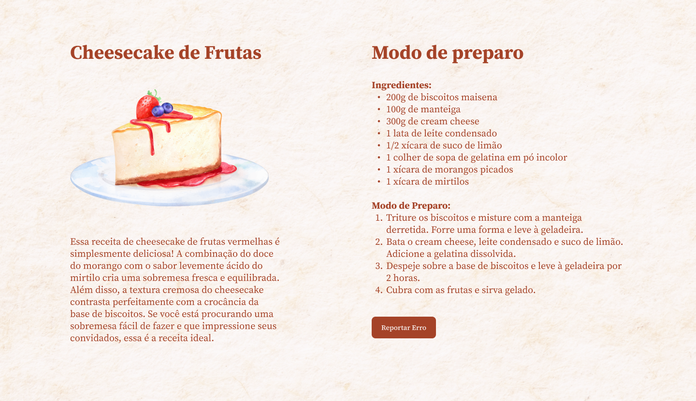

<h1 align="center">Projeto Stage 03 Responsividade - Explorer Rocketseat</h1>

<p align="center">

```Projeto Stage 03 Responsividade```

Do <a href="https://www.rocketseat.com.br/explorer">Explorer</a>, da Rocketseat, Um programa de formação onde você irá aprender a programar do zero rumo a sua conquista pela primeira vaga na programação.</p>

<p align="center">
  <a href="#-tecnologias">Tecnologias</a>&nbsp;&nbsp;&nbsp;|&nbsp;&nbsp;&nbsp;
  <a href="#-projeto">Projeto</a>&nbsp;&nbsp;&nbsp;|&nbsp;&nbsp;&nbsp;
  <a href="#-layout">Layout</a>&nbsp;&nbsp;&nbsp;|&nbsp;&nbsp;&nbsp;
  <a href="#memo-licença">Licença</a>
</p>

<p align="center">
  
</p>

<br>

<p align="center">
  
</p>

## 🚀 Tecnologias

Esse projeto foi desenvolvido com as seguintes tecnologias:

- HTML e CSS
<!-- - JavaScript e JSON
- [Node e NPM](https://nodejs.org/)
- [Vite](https://vitejs.dev/)
- [iMask](https://imask.js.org) -->

## 💻 Projeto

Esse projeto é o Projeto Stage 03 - Responsividade ministrado pela <a href="https://www.rocketseat.com.br/">Rocketseat</a> no programa de formação explorer, com intuito de ensino das tecnologias voltadas para web.

## 🔖 Layout

Você pode visualizar o layout do projeto através [DESSE LINK](https://www.figma.com/file/er5TcrKutngAs12X4d02A3/Cheesecake-%E2%80%A2-Projeto-Explorer-(Community)?node-id=1%3A754&mode=dev). É necessário ter conta no [Figma](https://figma.com) para acessá-lo.

## :memo: Licença

Esse projeto está sob a licença MIT.

## Atualmente estudando

<!--  -->
<!--  -->


<br />
<br />
 
  ## Meus contatos
 
<div> 
  
  <a href="@naatlr.dev" target="_blank"></a>
 <a href="naatlr#1575" target="_blank"></a> 
  <a href = "natalialourenco12@gmail.com"></a>
  <a href="https://www.linkedin.com/in/naatlr/" target="_blank"></a>
  
            
          
          
 


</div>

---
Feito com ♥ by Natália Oliveira !